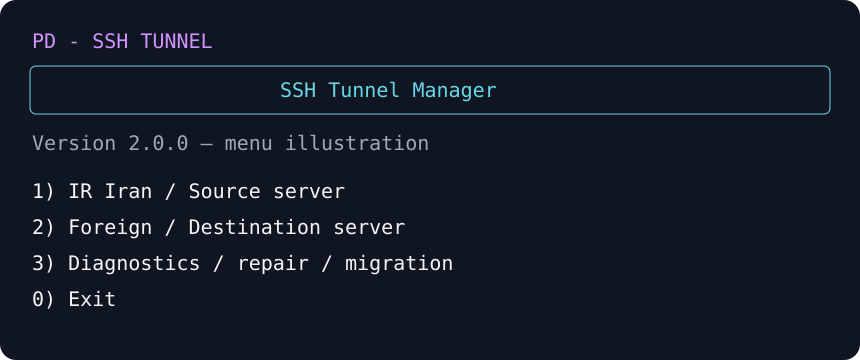

# PD - SSH Tunnel

[فارسی](#راهنمای-فارسی) | [English](#english-guide)



[Releases](https://github.com/Mehdi682007/pd-ssh-tunnel/releases) · [Changelog](CHANGELOG.md) · [MIT License](LICENSE)


## راهنمای فارسی

مدیریت تعاملی تونل SSH پایدار بین سرور ایران و سرور خارج با پشتیبانی از `autossh` و `systemd`.

## امکانات

- ساخت Local Forward (`-L`) برای خروجی از سرور خارج
- ساخت Reverse Forward (`-R`) برای دسترسی معکوس
- نصب خودکار یا دستی کلید SSH
- کاربر اختصاصی و محدودشده `revtunnel`
- بررسی وضعیت، لاگ‌ها و اتصال SSH
- مدیریت چند Port Forward
- اجرای خودکار پس از راه‌اندازی مجدد سرور
- پروفایل اختیاری افزایش سرعت با BBR، `fq` و تنظیمات بهینه SSH
- بکاپ و حذف امن تنظیمات

## نصب سریع

روی هر دو سرور ایران و خارج اجرا کنید:

```bash
bash <(curl -fsSL https://raw.githubusercontent.com/Mehdi682007/pd-ssh-tunnel/main/pd-ssh-tunnel.sh)
```

یا با `wget`:

```bash
wget -qO pd-ssh-tunnel.sh https://raw.githubusercontent.com/Mehdi682007/pd-ssh-tunnel/main/pd-ssh-tunnel.sh
chmod +x pd-ssh-tunnel.sh
sudo ./pd-ssh-tunnel.sh
```

## ترتیب راه‌اندازی

1. روی سرور خارج، گزینه `Foreign / Destination server` و سپس `Initial setup` را اجرا کنید.
2. روی سرور ایران، گزینه `Iran / Source server` و سپس `Initial setup / Connect` را اجرا کنید.
3. برای خروجی از سرور خارج، یک `Local forward (-L)` بسازید.
4. در صورت نیاز، گزینه `Speed optimization` را روی هر دو سرور فعال کنید.
5. سرویس تونل را روی سرور ایران Restart کنید.

## نمونه مسیر 3x-ui

```text
Client -> Iran inbound -> Iran outbound (127.0.0.1:28888)
       -> SSH local forward -> Foreign inbound (127.0.0.1:28443)
       -> Direct Internet
```

در این نمونه IP خروجی، IP سرور خارج خواهد بود.

## سیستم‌عامل‌های پشتیبانی‌شده

- Ubuntu
- Debian
- سرویس‌دهی مبتنی بر systemd

اسکریپت باید با کاربر `root` یا `sudo` اجرا شود.

## نکات امنیتی

- هیچ رمز عبور یا کلید خصوصی داخل اسکریپت ذخیره نشده است.
- اثر انگشت SSH سرور خارج قبل از ذخیره نمایش داده می‌شود.
- پیش از استفاده روی سرور اصلی، تنظیمات و Port Forwardها را بررسی کنید.

---

## English Guide

An interactive manager for persistent SSH tunnels between a source server and a foreign destination server, powered by `autossh` and `systemd`.

### Features

- Local forwarding (`-L`) for foreign-server egress
- Reverse forwarding (`-R`) for reverse access
- Automatic or manual SSH public-key installation
- Dedicated and restricted `revtunnel` account
- SSH connectivity, service status, and log diagnostics
- Multiple port-forward management
- Automatic startup after a server reboot
- Optional performance profile using BBR, `fq`, larger network buffers, and optimized SSH settings
- Configuration backup and safe removal

### Quick installation

Run this command on both the source and foreign servers:

```bash
bash <(curl -fsSL https://raw.githubusercontent.com/Mehdi682007/pd-ssh-tunnel/main/pd-ssh-tunnel.sh)
```

Alternatively, use `wget`:

```bash
wget -qO pd-ssh-tunnel.sh https://raw.githubusercontent.com/Mehdi682007/pd-ssh-tunnel/main/pd-ssh-tunnel.sh
chmod +x pd-ssh-tunnel.sh
sudo ./pd-ssh-tunnel.sh
```

### Setup order

1. On the foreign server, select `Foreign / Destination server`, then run `Initial setup`.
2. On the source server, select `Iran / Source server`, then run `Initial setup / Connect`.
3. For foreign-server egress, create a `Local forward (-L)`.
4. Optionally enable `Speed optimization` on both servers.
5. Restart the tunnel service on the source server.

### 3x-ui routing example

```text
Client -> Iran inbound -> Iran outbound (127.0.0.1:28888)
       -> SSH local forward -> Foreign inbound (127.0.0.1:28443)
       -> Direct Internet
```

In this example, the final public IP address is the foreign server's IP.

### Supported systems

- Ubuntu
- Debian
- Distributions using systemd

Run the script as `root` or through `sudo`.

### Security notes

- The script contains no embedded passwords or private keys.
- It displays the foreign server's SSH fingerprint before saving it.
- Review the configuration and forwarded ports before deploying on a production server.
